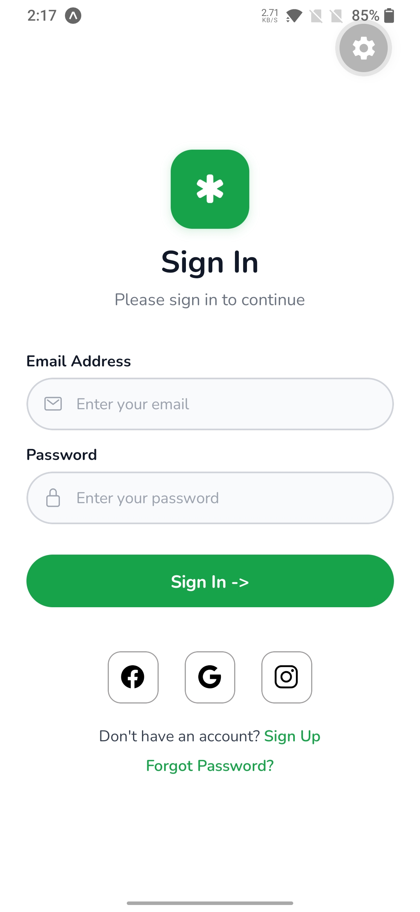
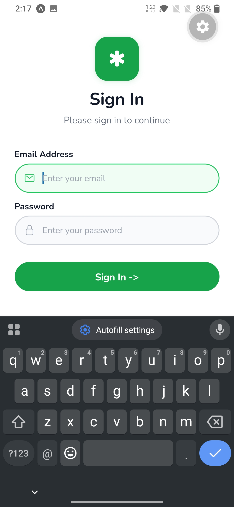

# React Native Sign In Screen

A React Native mobile authentication screen built with **Expo** and **core React Native components only**, recreated from a [Dribbble design reference](https://dribbble.com/shots/24783022-osler-AI-Telehealth-Telemedicine-App-Sign-In-Sign-Up-UI).

---

## App Screenshot

> 
> 


---

## Features

| Feature | Details |
|---|---|
| App logo section | Green rounded badge with medical cross icon + app name & tagline |
| Heading & subheading | "Sign In" + "Please sign in to continue" |
| Email input | Pill-shaped input with mail icon; green border on focus |
| Password input | Pill-shaped input with lock icon; `secureTextEntry` enabled |
| Sign In button | Full-width green rounded button |
| Social login buttons | Facebook, Google, Instagram icon buttons with bordered styling |
| Forgot Password | Tappable green text link |
| Sign Up | Inline tappable link in footer |
| Keyboard handling | `KeyboardAvoidingView` + `ScrollView` for safe keyboard interaction |
| Font | Nunito (Google Fonts, Vernon Adams) — Regular, SemiBold, Bold |

---

## Tech Stack

- [React Native](https://reactnative.dev/)
- [Expo](https://expo.dev/) (SDK 55)
- [Expo Router](https://expo.github.io/router/) — file-based routing
- [`@expo-google-fonts/nunito`](https://github.com/expo/google-fonts/tree/master/font-packages/nunito) — Nunito font
- `@expo/vector-icons` (Ionicons) — icons bundled with Expo
- No third-party UI libraries

---

## Project Structure

```
src/
└── app/
    ├── _layout.tsx   # Root layout — loads Nunito fonts, hides header
    └── index.tsx     # Sign In screen
```

---

## Getting Started

```bash
# Install dependencies
npm install

# Start the development server
npx expo start
```

Open in:
- **iOS Simulator** — press `i`
- **Android Emulator** — press `a`
- **Expo Go** (physical device) — scan the QR code

---

## Design Reference

[Osler AI Telehealth — Dribbble](https://dribbble.com/shots/24783022-osler-AI-Telehealth-Telemedicine-App-Sign-In-Sign-Up-UI)
